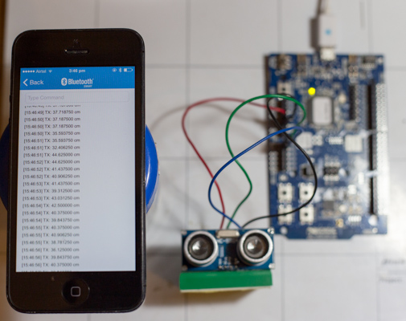

In this project, we will talk to the popular ultrasonic distance
sensor HC-SR04 using the Nordic nRF51-DK board, and transmit the
distance information over BLE using the NUS (Nordic UART Service). We
will be utilizing *GPIO* and *Timer1* for this purpose.

Read more at:

http://electronut.in/nrf51-hcsr04/

